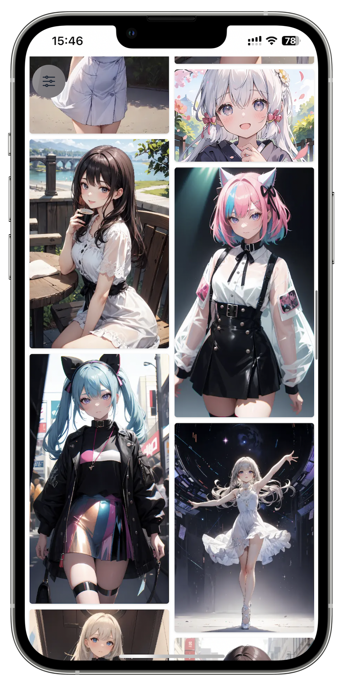
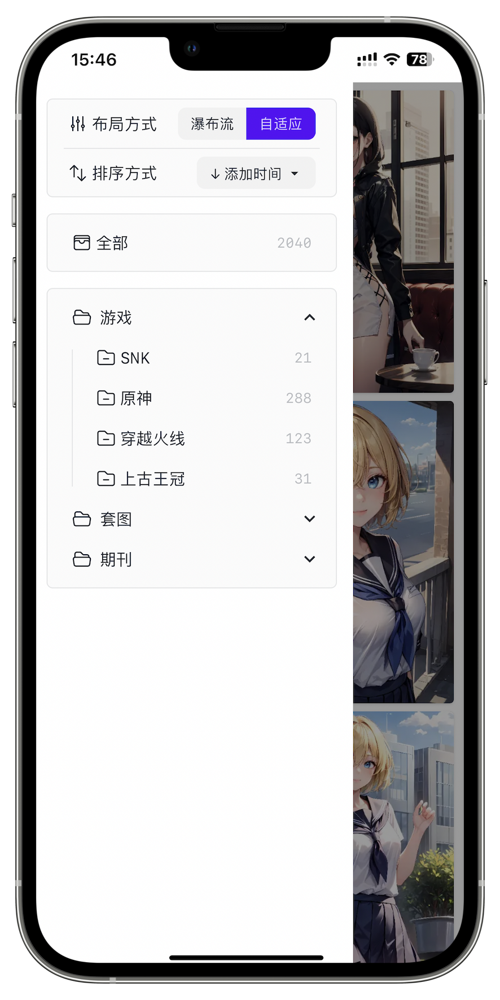
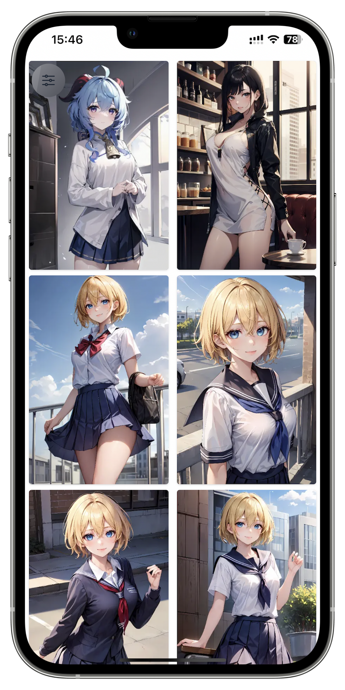
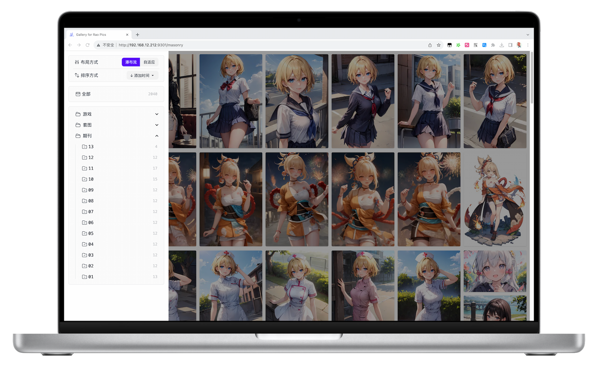
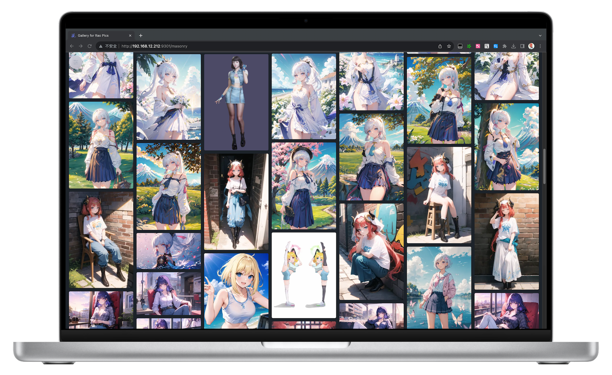
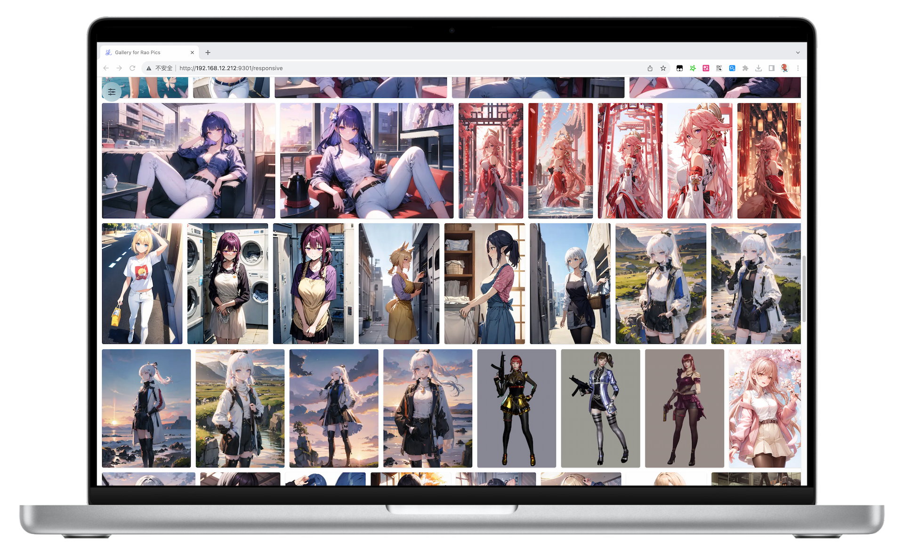
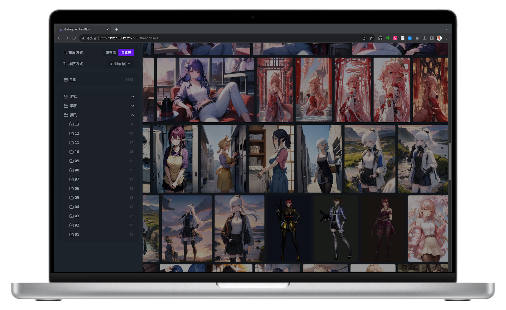

| [中文简体](./README.md) | English |

<div align="center">
    <a href="https://rao.pics" target="_blank">
        
    </a>
    <h1 align="center">Rao Pics</h1>
    <p align="center">Helps you remotely access Eagle's material library</p>
    <p align="center">
        <a href="https://codecov.io/gh/meetqy/rao-pics" target="_blank"></a>
        <a href="https://github.com/rao-pics/core/blob/main/LICENSE" target="_blank"></a>
        <a href="https://github.com/rao-pics/core/releases" target="_blank"></a>
        <a href="https://github.com/rao-pics/rao-pics/releases" target="_blank"></a>
        <a href="https://app.fossa.com/projects/git%2Bgithub.com%2Fmeetqy%2Frao-pics?ref=badge_small" title="FOSSA Status"></a>
    </p>
</div>

<div align="center">
    
    
</div>

<div align="center">
    
    
</div>

---

<p align="center">
    :white_check_mark: Download now:
    <a href="https://github.com/meetqy/rao-pics/releases/latest">MAC M1</a>
    <span> </span>·:runner:·<span> </span>
    <a href="https://github.com/meetqy/rao-pics/releases/latest">MAC INTER</a>
    <span> </span>·:runner:·<span> </span>
    <a href="https://github.com/meetqy/rao-pics/releases/latest">WINDOWS</a>
</p>

> If you are unable to open it after installation on macOS, getting an error of untrusted or moved to the trash, execute the following command and then start again:
>
> ```sh
> sudo xattr -d com.apple.quarantine /Applications/Rao\ Pics.app
> ```

---

## Features

- 🎨 Over 30 color schemes to choose from, and you can also customize the theme to suit your preferences
- 🔌 Incremental updates and real-time synchronization, fast and no waiting required
- 🔐 Does not modify any of your files, generates indexes by reading, even if there is a mistake, it will not cause any harm to the metadata
- 🔸 Very simple, you just need to click, and you can view materials on other devices
- 📱 Supports mobile phones, tablets, and PCs at the same time
- 📌 The default theme supports PWA, you can save it as an app without opening the browser every time
- 🎊 Can access materials without relying on management software, and can even be deployed on Windows/MacOS servers

## Default Theme Gallery

Currently supports WEB PWA, you can directly save the webpage as an app

|  Waterfall |  Menu |  Adaptive |
| :-------------------------------------------------------------------------------------: | :---------------------------------------------------------------------: | :-----------------------------------------------------------------------------: |

PC

|      |  |
| --------------------------------------------------------------------- | ---------------------------------------------------------------------------- |
|  |              |

## ❤️ Support

- This project has joined the [Eagle Affiliate Program](https://eagle.cool/affiliate). If you happen to want to purchase [Eagle App - Essential tool for image collection and management](https://eagle.sjv.io/rao), you can click [Buy](https://eagle.sjv.io/rao) to support the author 😘😘😘
- If you like Rao.Pics, you can star it on GitHub, and it is even more welcome to [recommend](https://twitter.com/intent/tweet?text=View%20Images%20on%20Any%20device.https://github.com/rao-pics/core) it to like-minded friends
- You can follow me on [Twitter](https://twitter.com/meetqy) to get the latest news, or add WeChat `-meetqy-` to join the group **(remember to mention GITHUB)**

---

<a href="https://eagle.sjv.io/rao">
    
</a>

## Other Versions

- [Electron 0.7.16](https://github.com/meetqy/rao-pics/tree/turbo-electron-prisma) - Original Electron App
- [Docker](https://github.com/rao-pics/docker) - Supports Eagle, the material library is large, and synchronization may be a bit slow
- [Eagle Api](https://github.com/meetqy/eagle-api) - Gives your eagle the ability to query through API, based on json-server

## ❤️ Acknowledgements


---

| <a href="https://www.jetbrains.com/zh-cn/community/opensource/#support"></a> | <a href="https://developer.mend.io/github/meetqy/rao-pics"></a> | <a href="https://app.fossa.com/projects/git%2Bgithub.com%2Fmeetqy%2Frao-pics/refs/branch/main/3bad02d7e6c4f87c4170d847e106573e12f811dd/preview"></a> | <a href="https://app.codecov.io/gh/meetqy/rao-pics"></a> |
| :------------------------------------------------------------------------------------------------------------------------------------------------------------------------------------: | :------------------------------------------------------------------------------------------------------------------------------------: | :--------------------------------------------------------------------------------------------------------------------------------------------------------------------------------------------------------------------------: | :--------------------------------------------------------------------------------------------------------------------------: |
