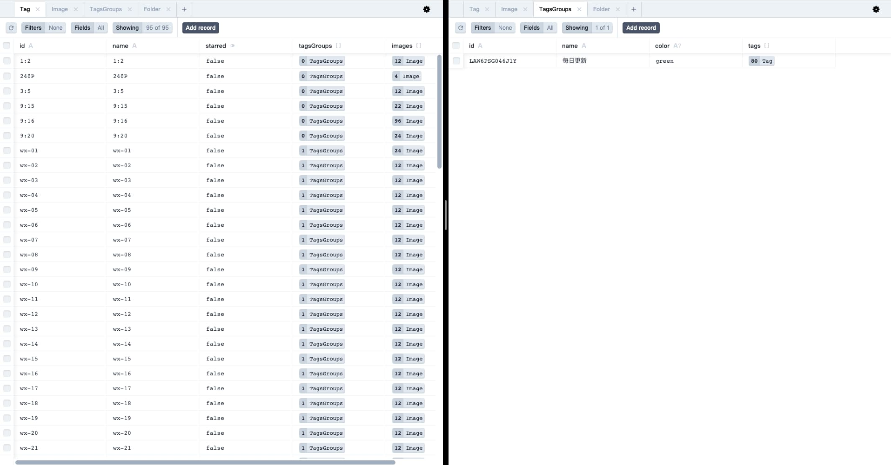
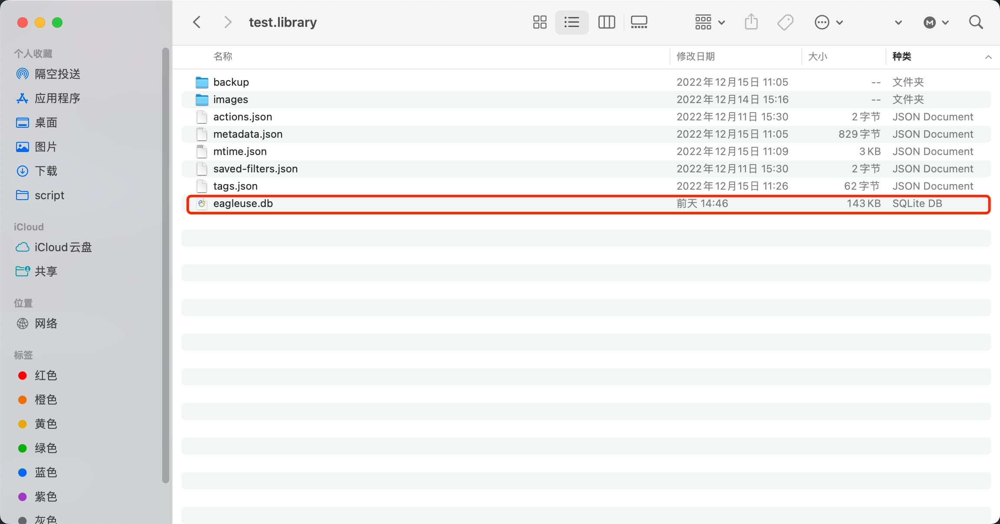

<p align='center'>

</p>

<p align='center'>
    <a href="https://github.com/meetqy/eagleuse/blob/master/LICENSE" target="_blank">
        
    </a>
    <a href="https://www.typescriptlang.org" target="_black">
        
    </a>
</p>

<p align='center'>
    <a href='https://rao.pics'>Online</a>
</p>

# 🦑 EagleUse

把 eagle 变成我的图片（后台）管理系统。

> 如果你也有这样的想法：eagle 修改/管理图片 => 网站上能实时查看。那这个项目非常合适，欢迎体验！

# 👀 介绍

### 起点

下面两个项目是该项目的起点，提供了很好的思路，有着特殊的意义，尽管用起来很麻烦！！！

- json-server 实现 eagle 查询 api 👉🏻 [eagle-api](https://github.com/meetqy/eagle-api)
- eagle-web 版本 👉🏻 [eagle-web](https://github.com/meetqy/eagle-web)

> 想要完整跑起来，你需要同时启动两个项目。

### 截图

_高度还原 Eagle_


_可视化数据&结构展示_


_数据管理及迁移_


# 🚀 本地安装

```sh
git clone https://github.com/meetqy/eagleuse
pnpm install
```

把 .env.example 改为 .env，正确填写配置信息

```sh
# 初始化 数据库
pnpm run db:init

# 创建静态资源软连接
pnpm run create:symlink

# 启动项目
pnpm run dev
```

# 📚 功能列表

### 基础功能

- 监听 library 生成对应的 sqlite 数据
- sqlite 数据文件可视化展示
- 基于 prisma，更加简单的使用
- library 静态资源托管
- 启动项目，随时更新 db 数据

### 页面

- 左侧菜单
- 等高展示图片
- 标签展示并显示图片数量
- 图片基础信息
- 查看原图
- 标签按颜色分类

### 搜索

- 按标签搜索

# 📄 开源协议

[MIT license](https://github.com/meetqy/eagleuse/blob/master/LICENSE) © [eagleuse](https://github.com/eagleuse)
