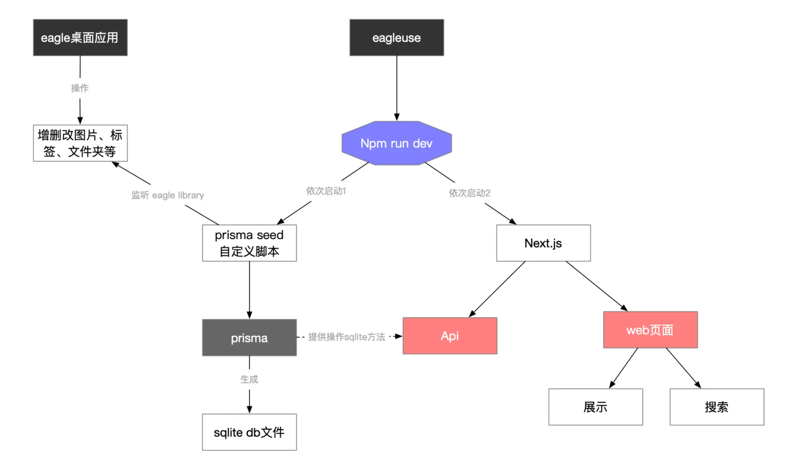

<p align='center'>
    <a href="https://github.com/meetqy/eagleuse/blob/master/LICENSE" target="_blank">
        
    </a>
    <a href="https://www.typescriptlang.org" target="_black">
        
    </a>
</p>

<p align='center'>
    <a href='https://rao.pics'>在线体验</a> ·
    <a href="./readme/api/image.md">查询API</a>
</p>

#  EagleUse

把 Eagle App 打造成本地后台管理系统，快速构建 WEB 图片站、自建图床。

> 如果你也有这样的想法：eagle app 本地修改/管理图片 => 实时构建网站并查看。那这个项目非常合适，欢迎体验！🚀🚀🚀

# 👀 介绍

### 定位

通过监听`eagle app library`构建图片站，同时只会具备 `展示/搜索` 2 个功能。



### 本地安装

```sh
git clone https://github.com/meetqy/eagleuse/tree/main
pnpm install
```

把 .env.example 改为 .env，正确填写配置信息

```sh
# 初始化 数据库
pnpm run db:init

# 启动项目
pnpm run dev
```

### Package Script 说明

| 名称          | 说明                                       |
| ------------- | ------------------------------------------ |
| `db:preview`  | 数据库可视化预览                           |
| `db:init`     | 初始化 prisma 数据库                       |
| `db:watch`    | 监听 eagle 变换，自动关联 sqlite，更新数据 |
| `db:generate` | `schema.prisma` 改变需要执行               |

# 📷 截图

|                      Left                       |                                 Right                                  |
| :---------------------------------------------: | :--------------------------------------------------------------------: |
|     <br/>首页      |           <br/>可视化数据&结构            |
|    <br/>标签管理   | <br/>只有一个 DB 文件，方便数据管理及迁移 |
|  <br/>选中父文件夹 |       <br/>文件夹展开,选中子文件夹        |

# 📚 功能列表

### 基础功能

- 监听 library 生成对应的 sqlite 数据
- sqlite 数据文件可视化展示
- 基于 prisma，更加简单的使用
- library 静态资源托管
- 启动项目，随时更新 db 数据

### 页面

- 左侧菜单
- 等高展示图片
- 标签展示并显示图片数量
- 图片基础信息
- 查看原图
- 标签按颜色分类
- 文件夹展示
- dark 模式

### 搜索

- 按标签搜索
- 按尺寸搜索
- 排序方式
- 按格式搜索
- 按注释搜索
- 按评分搜索

# 🔦 其他

下面两个项目是该项目的起点，提供了很好的思路，有着特殊的意义，尽管用起来很麻烦！！！

- json-server 实现 eagle 查询 api 👉🏻 [eagle-api](https://github.com/meetqy/eagle-api)
- eagle-web 版本 👉🏻 [eagle-web](https://github.com/meetqy/eagle-web)

> 想要完整跑起来，你需要同时启动两个项目。

# 📌 目前我所使用的同步/备份方案

坚果云+cadaver+davfs2

参考资料：

- [自动备份 Linux 上的博客数据到坚果云](https://chenyongjun.vip/articles/100)
- [Linux 通过安装 davfs2 来挂载 webdav 网盘](https://www.moerats.com/archives/317/)

可实现： 本地修改文件 -> 自动同步到坚果云 -> 自动拉取资源到 vps

总花费：30 元/月

# 📄 开源协议

[MIT license](https://github.com/meetqy/eagleuse/blob/master/LICENSE) © [EagleUse](https://github.com/eagleuse)
