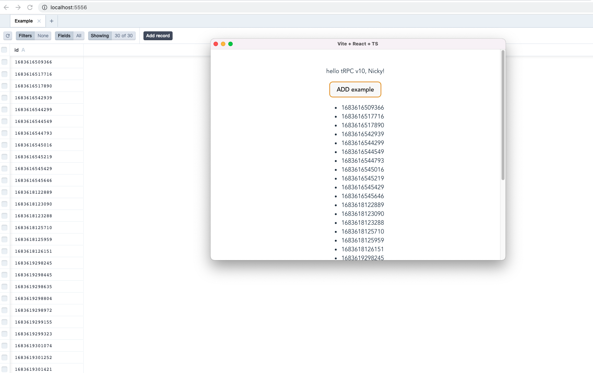

# turbo-electron-prisma

- turbo
- electron
- prisma
- ct3a

兼容 prisma studio 和 electron 同时使用，太酷啦 😎

## Installation

```sh
git clone https://github.com/rao-pics/turbo-electron-prisma.git
pnpm i
pnpm db:push
pnpm dev
```

## About

```
.vscode
  └─ Recommended extensions and settings for VSCode users
apps
  ├─ electron
packages
 ├─ api
 |   └─ tRPC v10 router definition
 └─ db
     └─ typesafe db-calls using Prisma
 └─ config
     └─ common config
```

## Thanks

- [electron-trpc-prisma](https://github.com/NickyMeuleman/electron-trpc-prisma)
- [create-t3-turbo](https://github.com/t3-oss/create-t3-turbo)
